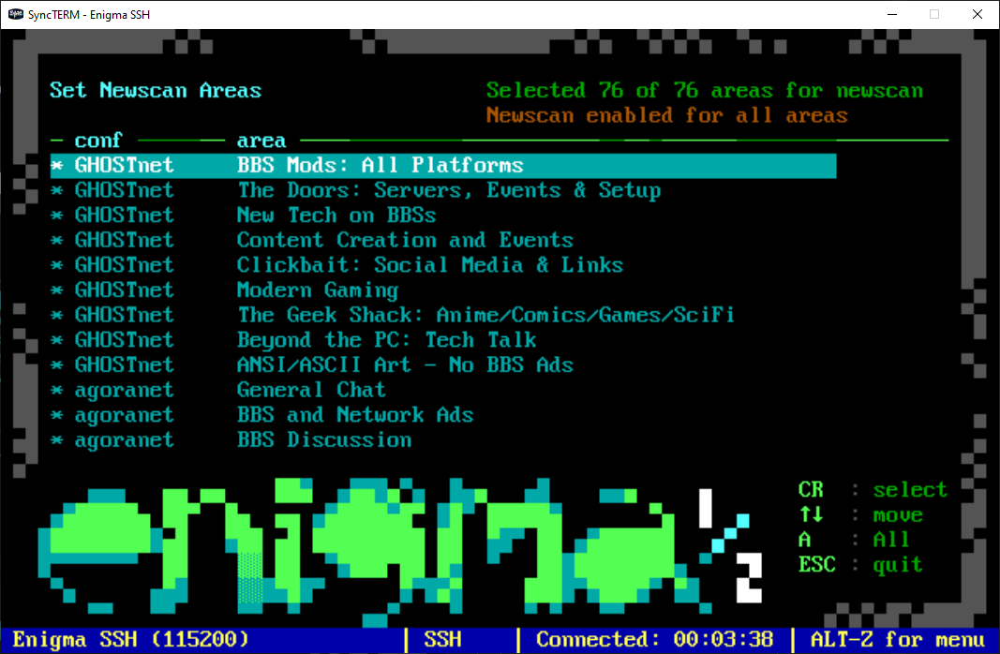

# Newscan Modules for ENiGMA½ BBS

[](LICENSE)
[](https://github.com/NuSkooler/enigma-bbs)



## Description

This package provides two modules that enhance ENiGMA½ BBS's newscan functionality:

1. **`ja_newscan.js`** - A modularized version of ENiGMA's default newscan functionality that works with the newscan config mod
2. **`ja_configure_newscan.js`** - A mod that allows users to select which message areas are included in their personal newscan

Together, these modules provide a complete, user-configurable newscan system that integrates seamlessly with ENiGMA½'s existing message area infrastructure while giving users control over their newscan experience.

## Features

### New Scan Module (`ja_newscan.js`)
- Modular version of ENiGMA's built-in newscan functionality
- Scans message conferences and file base areas for new content
- Integration with user newscan area preferences

### Newscan Configuration (`ja_configure_newscan.js`)
- Interactive selection of message areas for newscan
- Toggle areas on/off with simple key presses
- Persistent storage of user preferences

## Prerequisites

- ENiGMA½ BBS installed and configured
- Existing message areas configured in your BBS

## Installation

### Installation

1. Clone this repository to a temporary location:
   ```bash
   git clone https://github.com/[username]/ja-newscan-modules.git
   cd ja-newscan-modules
   ```

2. Copy the modules to your ENiGMA½ mods directory:
   ```bash
   cp -r mods/ja_newscan /path/to/your/enigma-bbs/mods/
   cp -r mods/ja_configure_newscan /path/to/your/enigma-bbs/mods/
   ```

3. Copy the art file to your theme's art directory:
   ```bash
   cp art/CNEWSCAN.ANS /path/to/your/enigma-bbs/art/themes/[your-theme]/
   ```

## Configuration

### New Scan Module Configuration

Add the new scan module to your menu configuration:

```hjson
{
    jaNewScan: {
        desc: "New Scan"
        module: "@userModule:ja_newscan"
        art: "NEWSCAN"
        config: {
            messageListMenu: "newScanMessageList"
        }
    }
}
```

### Newscan Configuration Module

Add the configuration module to your menu system:

```hjson
{
    jaConfigureNewScan: {
        desc: "Configure Newscan Areas"
        module: "@userModule:ja_configure_newscan"
        art: "CNEWSCAN"
        config: {
            cls: true
        }
        form: {
            0: {
                mci: {
                    VM1: {
                        focus: true
                        submit: true
                        argName: "messageIndex"
                        height: 12
                        width: 65
                        row: 6
                        col: 5
                        itemFormat: "|16|03{text}"
                        focusItemFormat: "|19|15{text}"
                    }
                }
                submit: {
                    "*": [
                        {
                            value: {
                                messageIndex: null
                            }
                            action: "@method:selectArea"
                        }
                    ]
                }
                actionKeys: [
                    {
                        keys: [
                            "escape"
                        ]
                        action: "@method:done"
                    }
                ]
            }
        }
    }
}
```

### Integration with Message Base Menu

From your actual menu configuration, here's how the modules integrate with the message base menu:

```hjson
{
    messageBaseMainMenu: {
        desc: "Message Menu"
        art: "MSGMNU"
        prompt: "messageBaseMenuPrompt"
        config: {
            interrupt: "realtime"
        }
        submit: [
            // ... other menu options ...
            {
                value: {
                    command: "!"
                }
                action: "@menu:jaNewScan"
            }
            {
                value: {
                    command: "Z"
                }
                action: "@menu:jaConfigureNewScan"
            }
        ]
    }
}
```

## ANSI Art Requirements

### Configuration Art (`CNEWSCAN.ANS`)

Copy the provided `CNEWSCAN.ANS` file from the `art/` directory to your ENiGMA½ art directory.

## File Structure

The modules follow this structure:

```
mods/
├── ja_newscan/                         # Newscan module directory
│   └── ja_newscan.js                   # Main newscan module
├── ja_configure_newscan/               # Configuration module directory
│   └── ja_configure_newscan.js         # Main configuration module
art/
└── CNEWSCAN.ANS                        # Copy to your theme's art directory
```

### Data Integration

Both modules work together through ENiGMA½'s user property system:

```javascript
// Configure module saves user preferences
this.client.user.persistProperty('NewScanMessageAreaTags', newNewscanTags, callback);

// New scan module reads user preferences
const newscanTags = this.client.user.properties['NewScanMessageAreaTags'] || '';

// New scan respects configured areas when scanning
if (userSelectedAreas.includes(areaTag)) {
    // Include this area in the scan
}
```

## Changelog

### Version 1.0.0
- Initial release
- New Scan module: Modularized version of ENiGMA's default newscan
- Configure Newscan module: Interactive area selection
- Visual indicators for selected areas
- Persistent storage of user preferences

## License

This project is licensed under the BSD 2-Clause License - see the [LICENSE](LICENSE) file for details.

## Acknowledgments

- Thanks to [NuSkooler](https://github.com/NuSkooler) for ENiGMA½ BBS and the original newscan implementation
- Inspiration from classic BBS newscan functionality

## Related Resources

- [ENiGMA½ BBS Documentation](https://nuskooler.github.io/enigma-bbs/)
- [ENiGMA½ BBS Repository](https://github.com/NuSkooler/enigma-bbs)
- [Menu Module Development](https://nuskooler.github.io/enigma-bbs/modding/menu-modules.html)
- [Set Newscan Date Module](https://nuskooler.github.io/enigma-bbs/modding/set-newscan-date.html)
- [Message Area Configuration](https://nuskooler.github.io/enigma-bbs/configuration/message-areas.html)
- [Original ENiGMA½ new_scan.js](https://github.com/NuSkooler/enigma-bbs/blob/master/core/new_scan.js)
