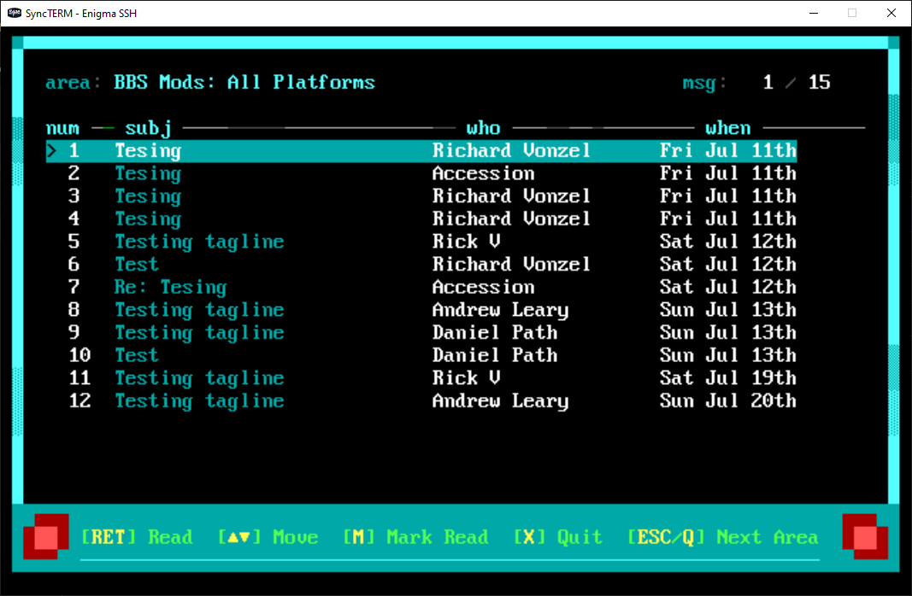
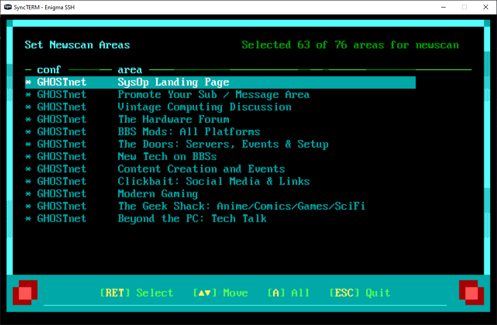
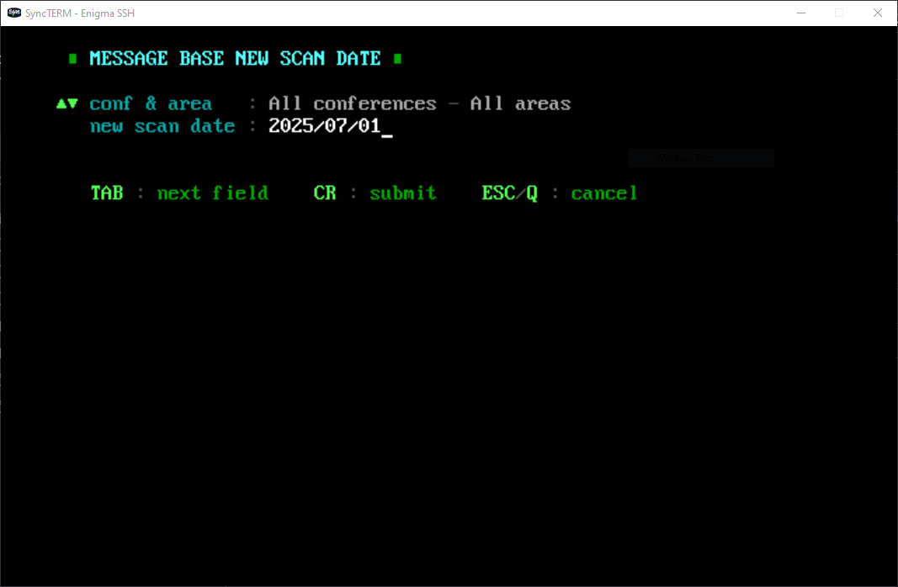

# ENiGMA½ Enhanced Newscan Mods

[](LICENSE)
[](https://github.com/NuSkooler/enigma-bbs)

A collection of three integrated modules that enhance the ENiGMA½ newscan experience with global newscan date support, user configuration, visual feedback, and improved workflow. Features proper newscan date handling that works consistently across all message areas and conferences.

## Screenshots

<table>
  <tr>
    <td align="center">
      
      <br/>
      <strong>Enhanced Newscan</strong>
      <br/>
      <em>Fast scanning with user-selected areas</em>
    </td>
    <td align="center">
      
      <br/>
      <strong>Configure Areas</strong>
      <br/>
      <em>Select which areas to scan</em>
    </td>
  </tr>
  <tr>
    <td align="center" colspan="2">
      
      <br/>
      <strong>Global Newscan Date</strong>
      <br/>
      <em>Set date that applies to all areas</em>
    </td>
  </tr>
</table>


## Features

- **Global Newscan Date**: Set a global newscan date that applies to ALL message areas across ALL conferences
- **Configurable Areas**: Users can select which message areas to include in their newscan
- **Visual Feedback**: Confirmation when marking all messages as read with status display
- **Auto-Advance**: Automatically continues to next area after marking messages as read
- **Login Menu Integration**: Optional automatic newscan prompt during login sequence
- **Cache Management**: Intelligent cache invalidation when users mark messages as read or change settings
- **ENiGMA½ Integration**: Follows ENiGMA½ patterns and conventions

## Modules Included

1. **`ja_configure_newscan`** - Interactive configuration interface for selecting newscan areas
2. **`ja_newscan`** - Enhanced newscan execution with user-selected area filtering  
3. **`ja_newscan_msg_list`** - Enhanced message list with visual feedback and auto-advance

## Installation

### 1. Copy Module Files

Copy the three module directories to your ENiGMA½ `mods/` directory:

```
enigma-bbs/
└── mods/
    ├── ja_configure_newscan/
    │   └── ja_configure_newscan.js
    ├── ja_newscan/
    │   └── ja_newscan.js
    └── ja_newscan_msg_list/
        └── ja_newscan_msg_list.js
```

### 2. Update Menu Configuration

Add these menu entries to your message base menu configuration file (e.g., `config/menus/your-theme-message_base.hjson`):

```hjson
{
  "menus": {
    // Add to your message base menu
    "messageBaseMainMenu": {
      // ... existing menu config ...
      "submit": [
        // ... existing submit actions ...
        {
          "value": {
            "command": "N"
          },
          "action": "@menu:jaNewScan"
        },
        {
          "value": {
            "command": "Z"
          },
          "action": "@menu:jaConfigureNewScan"
        }
        // ... other submit actions ...
      ]
    },

    // Add these new menu definitions
    "jaNewScan": {
      "desc": "New Scan",
      "module": "@userModule:ja_newscan",
      "art": "NEWSCAN",
      "config": {
        "messageListMenu": "newScanMessageList"
      }
    },

    "jaConfigureNewScan": {
      "desc": "Configure Newscan Areas",
      "module": "@userModule:ja_configure_newscan",
      "art": "CNEWSCAN",
      "config": {
        "cls": true
      },
      "form": {
        "0": {
          "mci": {
            "VM1": {
              "focus": true,
              "submit": true,
              "argName": "messageIndex",
              "height": 12,
              "width": 65,
              "itemFormat": "|16|03{text}",
              "focusItemFormat": "|19|15{text}"
            }
          },
          "submit": {
            "*": [
              {
                "value": {
                  "messageIndex": null
                },
                "action": "@method:selectArea"
              }
            ]
          },
          "actionKeys": [
            {
              "keys": ["escape"],
              "action": "@method:done"
            },
            {
              "keys": ["a", "shift + a"],
              "action": "@method:toggleAllAreas"
            },
            {
              "keys": ["g", "shift + g"],
              "action": "@method:setGlobalNewscanDate"
            }
          ]
        }
      }
    }
  }
}
```

### 3. Update Login Menu Configuration

#### Login Sequence Newscan Integration (Optional but Recommended)

To integrate newscan into your login sequence so users are prompted automatically after login, add these entries to your login menu configuration file (e.g., `config/menus/your-theme-login.hjson`):

```hjson
{
  "menus": {
    // Update your onelinerz menu to conditionally show newscan prompt
    "fullLoginSequenceOnelinerz": {
      "desc": "Onelinerz",
      "module": "onelinerz",
      "next": [
        {
          // Users with 2+ calls get newscan prompt
          "acs": "NC2",
          "next": "fullLoginSequenceNewScanConfirm"
        },
        {
          // New users skip newscan
          "next": "fullLoginSequenceUserStats"
        }
      ]
      // ... rest of your onelinerz config ...
    },

    // Add newscan prompt menu
    "fullLoginSequenceNewScanConfirm": {
      "desc": "Logging In",
      "prompt": "loginGlobalNewScan",
      "submit": [
        {
          "value": {
            "promptValue": 0
          },
          "action": "@menu:fullLoginSequenceNewScan"
        },
        {
          "value": {
            "promptValue": 1
          },
          "action": "@menu:fullLoginSequenceUserStats"
        }
      ]
    },

    // Add newscan execution menu for login sequence
    "fullLoginSequenceNewScan": {
      "desc": "New Scan",
      "module": "@userModule:ja_newscan",
      "art": "NEWSCAN",
      "next": "fullLoginSequenceSysStats",
      "config": {
        "messageListMenu": "newScanMessageList"
      }
    },

    // Enhanced message list (used by both login and manual newscan)
    "newScanMessageList": {
      "desc": "New Message List",
      "module": "@userModule:ja_newscan_msg_list",
      "art": "NEWMSGS",
      "config": {
        "menuViewPost": "messageAreaViewPost"
      },
      "form": {
        "0": {
          "mci": {
            "VM1": {
              "focus": true,
              "submit": true,
              "argName": "messageIndex"
            },
            "TL6": {}
          },
          "submit": {
            "*": [
              {
                "value": {
                  "messageIndex": null
                },
                "action": "@method:selectMessage"
              }
            ]
          },
          "actionKeys": [
            {
              "keys": ["escape", "q", "shift + q"],
              "action": "@systemMethod:prevMenu"
            },
            {
              "keys": ["x", "shift + x"],
              "action": "@method:fullExit"
            },
            {
              "keys": ["m", "shift + m"],
              "action": "@method:markAllRead"
            }
          ]
        }
      }
    }
  },

  // Add the newscan prompt
  "prompts": {
    "loginGlobalNewScan": {
      "art": "GNSPMPT",
      "mci": {
        "TM1": {
          "argName": "promptValue",
          "items": [
            "yes",
            "no"
          ],
          "focus": true,
          "hotKeys": {
            "Y": 0,
            "N": 1
          },
          "hotKeySubmit": true
        }
      }
    }
  }
}
```

#### Minimal Configuration (Message List Only)

If you don't want login sequence integration and only want manual newscan, just update the `newScanMessageList` menu:

```hjson
{
  "menus": {
    "newScanMessageList": {
      "desc": "New Message List",
      "module": "@userModule:ja_newscan_msg_list",
      "art": "NEWMSGS",
      "config": {
        "menuViewPost": "messageAreaViewPost"
      }
      // ... rest of form config from above example ...
    }
  }
}
```

### 4. Update Art Files

#### Required: NEWMSGS Art File
Add the following MCI code to your NEWMSGS art file where you want the "All Messages marked as read" status message to appear:

```
%TL99
```

Position this MCI code in your art file where you want the status message to display (e.g., at the bottom of the screen or in a dedicated status area). The enhanced message list module will display ">> messages marked as read <<" at this location with proper styling.

#### Optional: Additional Art Files
You may want to create or customize these art files:
- `NEWSCAN` - Main newscan display
- `CNEWSCAN` - Configuration interface display
- `GNSPMPT` - Login sequence newscan prompt ("Do you want to scan for new messages?")

## Usage

### For Users

1. **Login Sequence**: After logging in (users with 2+ calls):
   - System prompts "Do you want to scan for new messages?"
   - Press `Y` for yes, `N` for no
   - If yes, newscan runs automatically with enhanced features

2. **Manual Newscan**: Press `N` in the message menu to run newscan
   - Only configured areas will be scanned (or all if none configured)
   - Press `M` to mark all messages in current area as read
   - Newscan automatically advances to next area with new messages

3. **Configure Areas**: Press `Z` in the message menu to configure which areas to scan
   - Use arrow keys to navigate areas
   - Press Enter to toggle area selection
   - Press `A` to toggle all areas
   - Press `G` to set global newscan date (applies to all areas)
   - Press Escape when done

### Key Bindings

**Configuration Interface:**
- `↑/↓` - Navigate areas
- `Enter` - Toggle area selection
- `A` - Toggle all areas
- `G` - Set global newscan date
- `Escape` - Done/Exit

**Newscan Message List:**
- `↑/↓` - Navigate messages  
- `Enter` - Read message
- `M` - Mark all as read (with auto-advance)
- `Q/Escape` - Back to newscan
- `X` - Exit newscan completely

## Technical Details

### Newscan Date Handling
The enhanced newscan system provides comprehensive newscan date support:

- **Core ENiGMA½ Integration**: Uses [`msgArea.getNewMessageCountInAreaForUser()`](https://github.com/NuSkooler/enigma-bbs/blob/master/core/message_area.js#L515) and [`msgArea.getNewMessagesInAreaForUser()`](https://github.com/NuSkooler/enigma-bbs/blob/master/core/message_area.js#L565) for proper newscan date handling
- **Global Newscan Date**: Additional filtering layer that applies a global date across all areas and conferences
- **Dual-Layer Filtering**: Respects both area-specific newscan dates (set via core ENiGMA½) and global newscan dates
- **Cache Invalidation**: Intelligent cache management when users mark messages as read or change settings

### Global Newscan Date System
```javascript
// Global newscan date filtering in getFilteredNewMessagesForArea()
const globalNewscanDate = self.client.user.properties['GlobalNewscanDate'];
if (globalNewscanDate) {
    const newscanMoment = moment(globalNewscanDate);
    const filteredMessages = newMessages.filter(msg => {
        const msgMoment = moment(msg.modTimestamp);
        return msgMoment.isValid() && msgMoment.isSameOrAfter(newscanMoment);
    });
}
```

### Data Storage
- User area selections are stored in the `NewScanMessageAreaTags` user property as a comma-separated string of area tags
- Global newscan date is stored in the `GlobalNewscanDate` user property as an ISO 8601 timestamp

### Module Dependencies
- All modules use only ENiGMA½ core APIs
- No external dependencies required
- Compatible with standard ENiGMA½ installations
- Optimized for SQLite database performance

### ACS Integration
- Respects all ENiGMA½ Access Control System (ACS) settings
- Only shows areas users have access to
- Maintains security boundaries

### Cache Management System
```javascript
const newscanCache = {
    batchResults: new Map(),        // userId -> {results, timestamp}
    areaAccess: new Map(),          // userId_areaTag -> boolean
    cacheTimeout: 30000,            // 30 seconds
    
    invalidateUser(userId) {
        // Invalidates cache when user marks messages as read or changes settings
        this.batchResults.delete(userId);
    }
};

// Cache invalidation is triggered by:
// - Marking messages as read (ja_newscan_msg_list)
// - Changing newscan area configuration (ja_configure_newscan)
// - Setting global newscan date (ja_configure_newscan)
```

## Troubleshooting

### Module Not Loading
- Ensure module files are in correct directories under `mods/`
- Check ENiGMA½ logs for module loading errors
- Verify menu configuration syntax is valid HJSON

### Art Display Issues  
- Ensure `%TL99` MCI code is added to NEWMSGS art file
- Check art file paths in menu configuration
- Verify art files exist and are accessible

### Configuration Not Saving
- Check database permissions  
- Verify ENiGMA½ user property system is working
- Check logs for database errors

## File Structure

The enhanced modules follow this structure:

```
mods/
├── ja_newscan/                         # Newscan module directory
│   └── ja_newscan.js                   # Main newscan module
├── ja_configure_newscan/               # Configuration module directory
│   └── ja_configure_newscan.js         # Main configuration module
├── ja_newscan_msg_list/                # Enhanced message list directory
│   └── ja_newscan_msg_list.js          # Enhanced message list with auto-advance
art/
└── CNEWSCAN.ANS                        # Copy to your theme's art directory
```

### Data Integration

All modules work together through ENiGMA½'s user property system:

```javascript
// Configure module saves user preferences (immediately, on every change)
this.client.user.persistProperty('NewScanMessageAreaTags', newNewscanTags, callback);

// New scan module reads user preferences
const newscanTags = this.client.user.properties['NewScanMessageAreaTags'] || '';

// Enhanced message list provides visual feedback and auto-advance
markAllRead() {
    // Mark messages as read with visual confirmation
    this.setViewText('allViews', 99, 'All Messages marked as read');
    // Auto-advance to next area
    setTimeout(() => { this.prevMenu(); }, 1000);
}
```

## License

This project is licensed under the BSD 2-Clause License - see the [LICENSE](LICENSE) file for details.

## Acknowledgments

- Thanks to [NuSkooler](https://github.com/NuSkooler) for ENiGMA½ BBS and the original newscan implementation
- Inspiration from classic BBS newscan functionality

## Related Resources

- [ENiGMA½ BBS Documentation](https://nuskooler.github.io/enigma-bbs/)
- [ENiGMA½ BBS Repository](https://github.com/NuSkooler/enigma-bbs)
- [Menu Module Development](https://nuskooler.github.io/enigma-bbs/modding/menu-modules.html)
- [Set Newscan Date Module](https://nuskooler.github.io/enigma-bbs/modding/set-newscan-date.html)
- [Message Area Configuration](https://nuskooler.github.io/enigma-bbs/configuration/message-areas.html)
- [Original ENiGMA½ new_scan.js](https://github.com/NuSkooler/enigma-bbs/blob/master/core/new_scan.js)
